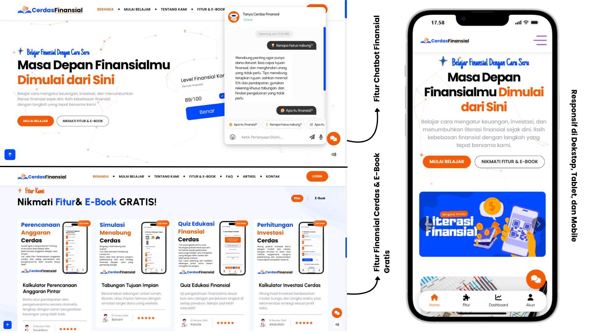

# Nama Tim: Skinfa Developers

## Nama Anggota Tim
1. Syafiq Bamazruk  
2. Kevan Mohammed Asghar

## Judul Project: Website Edukasi Finansial “Cerdas Finansial”
## Tema: “Innovation Beyond Limits: Empowering the Future with IT - From Creation to Innovation - Building a Sustainable Socio-Economic Future”

## 💡 Latar Belakang

Di era modern ini, banyak remaja dan dewasa muda yang belum memiliki pemahaman yang cukup tentang pengelolaan keuangan pribadi. Sebagian besar dari mereka belum mengenal konsep dasar seperti perencanaan anggaran, menabung, investasi, maupun manajemen pengeluaran secara efektif. Akibatnya, tidak sedikit yang menghadapi masalah finansial di usia muda, mulai dari pengeluaran boros, terlilit hutang, hingga minimnya tabungan jangka panjang.

Melihat kondisi tersebut, kami terinspirasi untuk menciptakan sebuah website edukasi finansial yang menarik, interaktif, dan mudah dipahami. Tujuannya adalah memberikan wadah bagi generasi muda untuk belajar mengatur keuangan secara cerdas sejak dini, sehingga mereka dapat mengembangkan kebiasaan finansial yang sehat dan mempersiapkan masa depan dengan lebih bijak.

## ⚠️ Permasalahan

- Kurangnya pengetahuan remaja tentang manajemen keuangan pribadi.
- Minimnya platform edukasi finansial yang dikemas secara menarik dan interaktif.
- Sulitnya menemukan alat bantu praktis untuk menghitung anggaran, investasi, dan tabungan.

## 🚀 Solusi

Website Cerdas Finansial hadir sebagai solusi digital edukatif yang membantu pengguna memahami konsep finansial secara menyenangkan.
Dengan desain yang sangat menarik, responsif, dan berfokus pada kesempurnaan UI/UX, website ini mempunyai tampilan yang mudah dipahami, profesional, dan nyaman digunakan di semua perangkat.
Setiap elemen dirancang dengan interaksi yang halus, layout modern, serta performa yang ringan, sehingga pengguna dapat belajar, menghitung, dan merencanakan keuangan mereka secara mandiri dengan pengalaman terbaik.

## 🎯 Tujuan & Manafaat

Website Cerdas Finansial memiliki tujuan utama untuk meningkatkan literasi finansial di kalangan remaja dan dewasa muda. Melalui platform ini, pengguna dapat belajar mengenai perencanaan anggaran, menabung, dan berinvestasi dengan cara yang mudah dipahami dan menyenangkan.

Beberapa manfaat utama dari website ini antara lain:

- Meningkatkan Pemahaman Finansial: Membantu generasi muda memahami konsep dasar manajemen keuangan, mulai dari anggaran hingga investasi.

- Platform Belajar Interaktif: Menyediakan pengalaman belajar yang seru melalui fitur-fitur interaktif seperti kalkulator anggaran, quiz edukasi, dan dashboard visual.

- Mendukung Pengambilan Keputusan Finansial: Membantu pengguna merencanakan pengeluaran, menabung sesuai target, dan membuat keputusan investasi dengan lebih bijak.

- Persiapan Masa Depan yang Lebih Baik: Mendorong generasi muda untuk memiliki kebiasaan finansial yang sehat dan siap menghadapi tantangan ekonomi di masa depan.

- Dengan tujuan dan manfaat tersebut, Cerdas Finansial tidak hanya berfungsi sebagai media edukasi, tetapi juga sebagai alat praktis untuk membentuk kebiasaan finansial yang cerdas, disiplin, dan berorientasi pada masa depan.

## 🧠 Fitur Unggulan

- 💰 Kalkulator Perencanaan Anggaran Pintar – membantu pengguna menghitung rencana keuangan bulanan.
- 🎯 Tabungan Tujuan – fitur menabung berdasarkan target yang ingin dicapai.
- 🧩 Quiz Edukasi Finansial – belajar sambil bermain agar tidak membosankan.
- 📈 Kalkulator Investasi – simulasi hasil investasi untuk berbagai jangka waktu.
- 🤖 Chatbot Tanya Finansial – asisten virtual yang menjawab pertanyaan seputar keuangan dan memberi tips bermanfaat.
- 📊 Dashboard – menampilkan hasil, progress, dan laporan keuangan pengguna dengan desain modern.
- 📚 Ebook Gratis – sumber belajar tambahan untuk mendukung peningkatan literasi finansial.

## 💻 Teknologi yang Digunakan

- HTML5 – untuk struktur halaman web

- CSS3 – untuk tampilan dan desain

- JavaScript – untuk logika interaktif dan fitur 

- Bootstrap – untuk desain responsif dan komponen modern

## 📂 Struktur Project
```
WEB_DESAIN_INVOFEST2025_SKINFADEVELOPERS/
│
├── assets/
│   ├── css/              # Berisi file stylesheet (tampilan dan desain)
│   ├── js/               # Berisi file JavaScript (logika dan interaktivitas)
│   └── media/            # Berisi gambar, ikon, dan aset multimedia lainnya
│
├── DASHBOARD/
│   └── index.html        # Halaman dashboard interaktif pengguna
│   └── analisis-keuangan.html  # Halaman dashboard interaktif pengguna
│
├── _DOKUMENTASI.png      # Gambar dokumentasi proyek
├── .htaccess             # Pengaturan URL rewrite agar link lebih rapi
│
├── about.html            # Halaman tentang website
├── artikel-1.html        # Artikel 1
├── artikel-2.html        # Artikel 2
├── artikel-3.html        # Artikel 3
│
├── belajarfinansial.html # Halaman pembelajaran finansial
│
├── ebook-1.html          # Ebook literasi finansial 1
├── ebook-2.html          # Ebook literasi finansial 2
├── ebook-3.html          # Ebook literasi finansial 3
├── ebook-4.html          # Ebook literasi finansial 4
│
├── faq.html              # Halaman Pertanyaan Populer
│
├── fitur-detail-1.html   # Detail fitur: Kalkulator Anggaran
├── fitur-detail-2.html   # Detail fitur: Tabungan Tujuan
├── fitur-detail-3.html   # Detail fitur: Quiz Edukasi
├── fitur-detail-4.html   # Detail fitur: kalkulator Investasi
│
├── index.html            # Halaman utama website Include Chatbot
├── kontak.html           # Halaman kontak 
├── login.html            # Halaman login pengguna
├── register.html         # Halaman pendaftaran pengguna
│
└── README.md             # Dokumentasi proyek
```
## Website tersedia (Aktif) :
https://CerdasFinansial.netlify.app

## Dokumentasi Proyek : 

